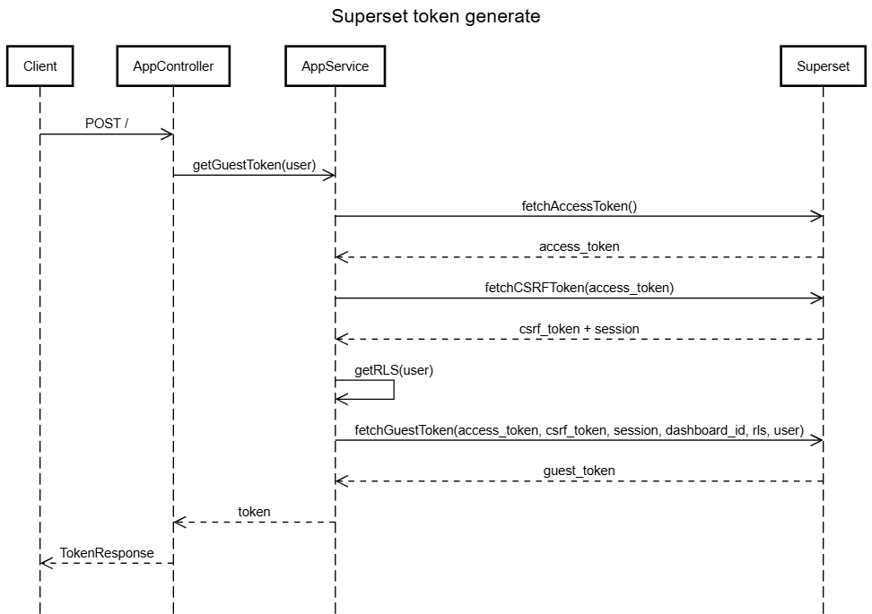

# Superset Guest Token Service Documentation

## Overview

This NestJS application provides a service for generating guest tokens from Apache Superset. Guest tokens are used to embed Superset dashboards in external applications with row-level security (RLS) rules applied based on user permissions.

## Architecture

The application follows a standard NestJS architecture with:
- **Controller** (`app.controller.ts`): Handles HTTP requests
- **Service** (`app.service.ts`): Contains business logic for token generation
- **Configuration**: Uses NestJS ConfigService for managing Superset connection details

## API Endpoints

### GET /
Returns a simple "Hello World" message to verify the service is running.

**Response:**
```
Hello World
```

### POST /
Generates a guest token for embedding Superset dashboards.

**Response:**
```json
{
  "status": "success",
  "token": "eyJ0eXAiOiJKV1QiLCJhbGciOi..."
}
```

**Error Response:**
```json
{
  "status": "failure",
  "error": "Error message details"
}
```

## How It Works

The guest token generation process involves multiple steps:

### 1. Authentication Flow



### 2. User Object Structure

The application uses a hardcoded user object in the controller:

```typescript
{
  username: 'admin',
  first_name: 'Admin',
  last_name: 'User',
  user_type: 'ADMIN',
  organisation_id: 1,
  locations: '1|||2'  // Pipe-separated location IDs
}
```

### 3. Row-Level Security (RLS)

The service applies RLS rules based on user attributes:

- **Organization filtering**: Applied for non-ADMIN users
- **Location filtering**: Applied based on user's assigned locations

The RLS rules are generated as SQL clauses:
```sql
organisation_id IN (1)
practice_location_id IN (1,2)
```

## Configuration

The service requires the following environment variables for Superset connection:

```typescript
interface SUPERSET_CONFIG {
  url: string;        // Superset base URL
  username: string;   // Superset admin username
  password: string;   // Superset admin password
}
```

## Type Definitions

### TokenResponse
```typescript
interface TokenResponse {
  status: 'success' | 'failure';
  token?: string;
  error?: string;
}
```

### User
```typescript
interface User {
  username: string;
  first_name: string;
  last_name: string;
  user_type: string;
  organisation_id: number;
  locations: string;  // Pipe-separated location IDs
}
```

### DecodedUser
```typescript
interface DecodedUser extends Omit<User, 'locations'> {
  locations: number[];  // Parsed location IDs
}
```

### RLS (Row-Level Security)
```typescript
type RLS = Array<{
  clause: string;
}>;
```

## Error Handling

The service includes error handling at each step:
- Logs errors using NestJS Logger
- Returns structured error responses
- Preserves error context for debugging

## Security Considerations

1. **Hardcoded User**: The current implementation uses a hardcoded admin user. In production, this should be replaced with actual user authentication.

2. **Dashboard ID**: The dashboard ID is hardcoded (`30ddf642-4c36-40ee-ade2-fc77e6285a6c`). This should be configurable or passed as a parameter.

3. **Credentials**: Ensure Superset credentials are stored securely using environment variables or a secrets management system.

## Usage Example

To use this service in a frontend application:

```javascript
// Fetch guest token
const response = await fetch('http://your-service-url/', {
  method: 'POST',
  headers: {
    'Content-Type': 'application/json'
  }
});

const data = await response.json();

if (data.status === 'success') {
  // Use the token to embed Superset dashboard
  const dashboardUrl = `${SUPERSET_URL}/superset/dashboard/${DASHBOARD_ID}/?guest_token=${data.token}`;
  
  // Embed in iframe
  document.getElementById('dashboard-iframe').src = dashboardUrl;
}
```

## Development Setup

1. Install dependencies:
   ```bash
   npm install
   ```

2. Configure environment variables for Superset connection

3. Run in development mode:
   ```bash
   npm run start:dev
   ```

## Troubleshooting

### Common Issues

1. **CSRF Token Errors**: Ensure cookies are properly handled in the session
2. **Authentication Failures**: Verify Superset credentials and URL
3. **RLS Not Applied**: Check that the RLS clauses match your Superset dataset columns

### Debug Mode

Enable debug logging by setting the log level in your NestJS configuration:
```typescript
Logger.setLogLevel(['debug']);
```

## API Response Types

### FetchAccessTokenResponse
Contains the access token from Superset login:
```typescript
interface FetchAccessTokenResponse {
  access_token: string;
  refresh_token?: string;
}
```

### FetchCSRFTokenResponse
Contains CSRF token and session cookie:
```typescript
interface FetchCSRFTokenResponse {
  result: string;  // CSRF token
  session: string; // Session cookie
}
```

### FetchGuestTokenResponse
Contains the final guest token:
```typescript
interface FetchGuestTokenResponse {
  token: string;
}
```

## Dependencies

- **@nestjs/core**: Core NestJS framework
- **@nestjs/axios**: HTTP client for API calls
- **@nestjs/config**: Configuration management
- **axios**: HTTP client library
